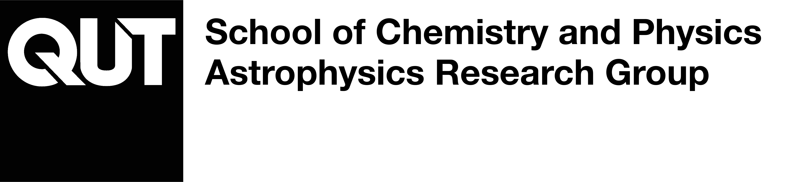

# Astro_Demos



Interactive browser-based demonstrations for teaching astrophysics at QUT, developed by the QUT Astrophysics Research Group [(QARG)](https://research.qut.edu.au/qutastrophysics/). Each demo is a self-contained HTML page that runs in any modern browser with no installation, and is designed to be embedded directly into Canvas.

Companion repository: [Astro_Code](https://github.com/mjcowley/Astro_Code), a collection of Python code for astronomical analysis.

## Demos

| Demo | Description |
| --- | --- |
| [Redshift Explorer](https://mjcowley.github.io/Astro_Demos/redshift-explorer/) | Drag a slider to redshift a template galaxy spectrum through a set of optical and near-infrared filters. |

## Embedding in Canvas

Canvas strips JavaScript from pasted HTML, so the demos are hosted here via GitHub Pages and pulled in with an iframe. In the Canvas Rich Content Editor, switch to the HTML view and add:

```html
<iframe src="https://mjcowley.github.io/Astro_Demos/redshift-explorer/"
        width="100%" height="900" style="border:1px solid #ccc;"
        title="Redshift Explorer"></iframe>
```

Set the height generously, since a cross-origin iframe cannot resize itself to fit its content.

## Structure

Each demo lives in its own folder with `index.html` as the entry point, which keeps the published URLs clean.

## Contributing

Contributions are welcome! If you have any ideas for improvements or new demos, feel free to open an issue or submit a pull request.

## Acknowledgements

Special thanks to all contributors and to the open-source communities that make scientific computing and data visualisation possible.
